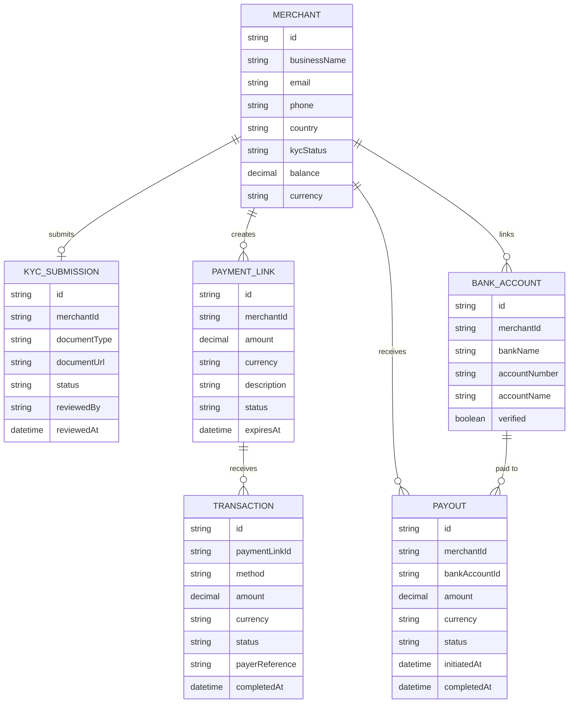

# Domain Model

The core entities behind merchant onboarding, hosted checkout, and settlement.

A `Merchant` submits one `KycSubmission` before it can go live, creates many
`PaymentLink`s, and each link receives `Transaction`s as customers pay it
through mobile money or card. A `Merchant` links one or more `BankAccount`s
and receives `Payout`s of its accumulated balance against one of them.