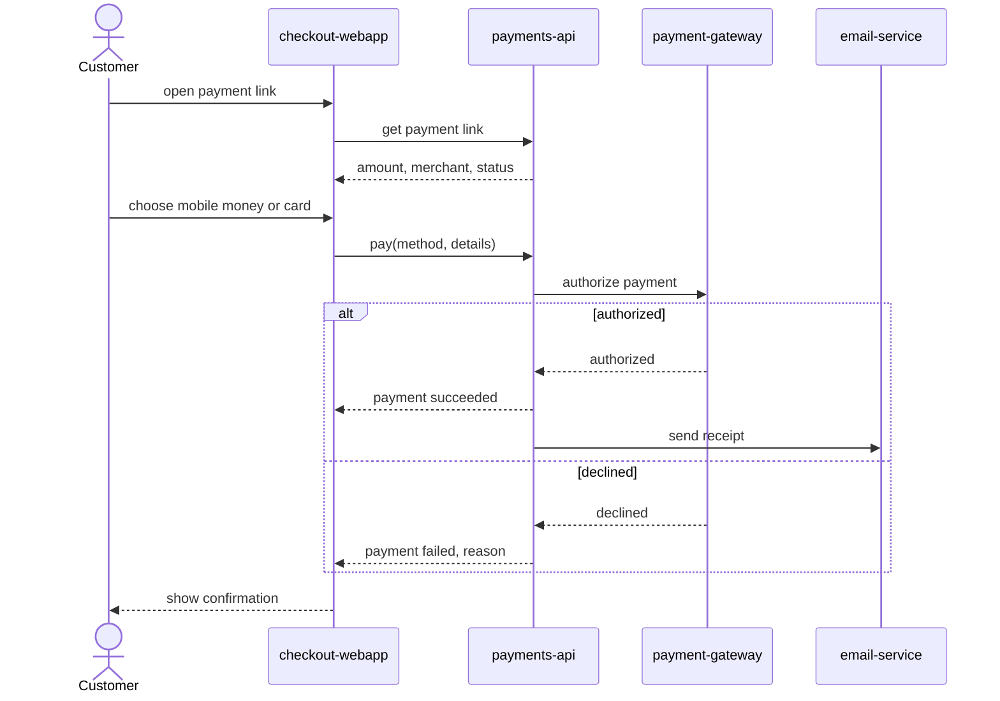

# Customer Checkout Payment

A Customer opens a merchant's payment link and pays it with mobile money or
a card, without creating an account.

```mermaid
sequenceDiagram
    actor Customer
    participant checkout as checkout-webapp
    participant api as payments-api
    participant gw as payment-gateway
    participant email as email-service

    Customer->>checkout: open payment link
    checkout->>api: get payment link
    api-->>checkout: amount, merchant, status
    Customer->>checkout: choose mobile money or card
    checkout->>api: pay(method, details)
    api->>gw: authorize payment
    alt authorized
        gw-->>api: authorized
        api-->>checkout: payment succeeded
        api->>email: send receipt
    else declined
        gw-->>api: declined
        api-->>checkout: payment failed, reason
    end
    checkout-->>Customer: show confirmation
```

