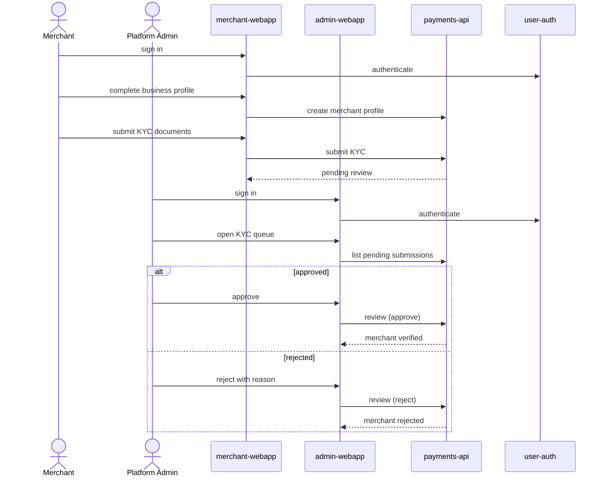

# Merchant Onboarding &amp; KYC

A Merchant signs up, sets up its business profile, and submits KYC
documents; a Platform Admin reviews the submission before the merchant can
collect live payments.

