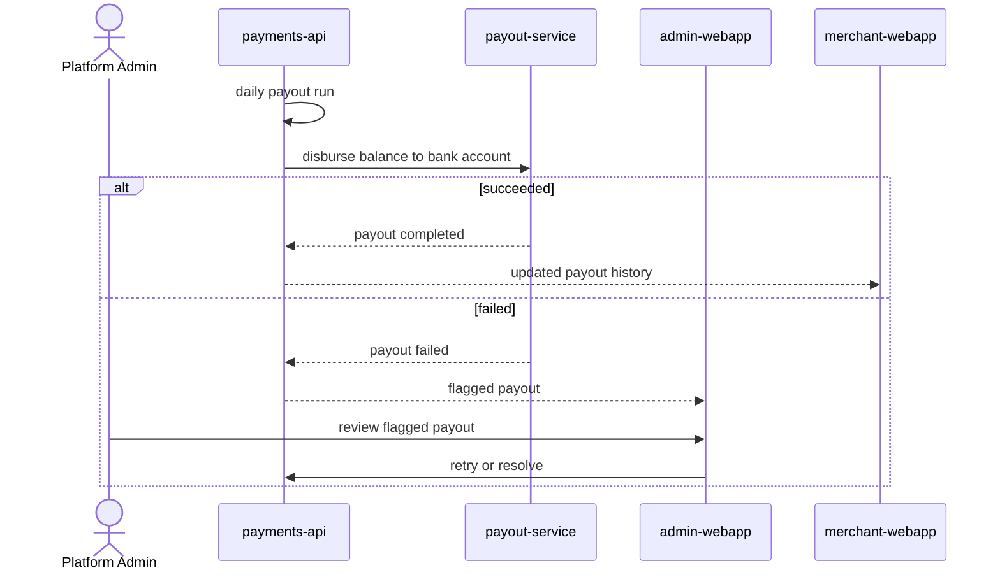

# Payout Settlement

The platform pays out each merchant's available balance to its linked bank
account once a day; a Platform Admin resolves any payout that fails.

```mermaid
sequenceDiagram
    actor Admin as Platform Admin
    participant api as payments-api
    participant payout as payout-service
    participant admin as admin-webapp
    participant webapp as merchant-webapp

    api->>api: daily payout run
    api->>payout: disburse balance to bank account
    alt succeeded
        payout-->>api: payout completed
        api-->>webapp: updated payout history
    else failed
        payout-->>api: payout failed
        api-->>admin: flagged payout
        Admin->>admin: review flagged payout
        admin->>api: retry or resolve
    end
```

